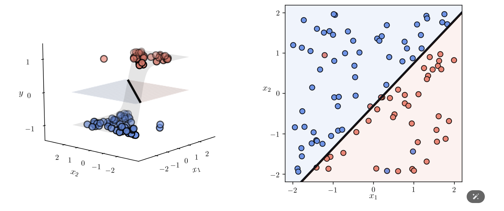

# 📊 Logistic Regression and Softmax Cost

## 🔍 Overview
This project explores **Logistic Regression** and the **Softmax Cost Function**, fundamental concepts in machine learning classification. It provides a theoretical understanding along with Python implementations.

## 📌 Key Concepts
- **Logistic Regression**: A binary classification algorithm.
- **Softmax Function**: Extends logistic regression to multiple classes.
- **Cross-Entropy Loss**: Measures classification performance.
- **Equivalence of Softmax and Cross-Entropy**.

## 📂 Project Structure
- **6_3_Logistic_Regression_and_Softmax_Cost.ipynb** → Jupyter Notebook with theory and code.
- **datasets/** → Sample data used for classification.
- **images/** → Plots and visualizations.

## 🛠 Installation & Setup
### 1️⃣ Clone the Repository
```bash
git clone https://github.com/arkistar4uu/Logistic_Regression_and_Softmax_Cost.git
```
### 2️⃣ Navigate to the Project Directory
```bash
cd logistic-softmax
```
### 3️⃣ Install Dependencies
Ensure you have Python 3.x installed, then install required libraries:
```bash
pip install numpy pandas matplotlib autograd
```
### 4️⃣ Run the Notebook
Launch Jupyter Notebook and open the file:
```bash
jupyter notebook
```

## 🚀 How It Works
1️⃣ **Define Logistic Regression & Softmax Cost Function**
2️⃣ **Compute Cross-Entropy Loss**
3️⃣ **Train and Evaluate Models**
4️⃣ **Visualize Results**

## 📊 Example Results


## 🤝 Contributing
Want to contribute? Fork the repository and submit a pull request! 🎉

## 📄 License
This project is licensed under the **MIT License**.

---

⭐ **If you find this project helpful, don't forget to star the repository!** ⭐

